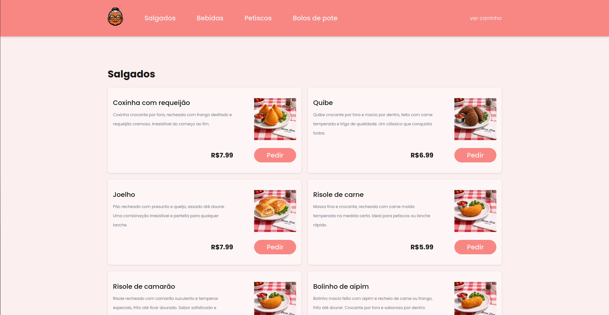

# Dona Ziva Lanches

Aplicação desenvolvida para uma lanchonete delivery, com foco em apresentação visual do cardápio, experiência do usuário e conversão de pedidos online.

## Sobre o projeto

O **Dona Ziva Lanches** foi desenvolvido como um website institucional moderno para uma lanchonete delivery, priorizando:

- identidade visual atrativa;
- navegação simples e intuitiva;
- responsividade;
- acesso rápido aos canais de contato e pedidos.

O projeto busca oferecer uma experiência agradável tanto em dispositivos móveis quanto em desktops.

---

## Tecnologias utilizadas

- Nextjs
- TypeScript
- TailwindCSS
- Supabase

---

## Responsividade

A aplicação foi construída com foco em responsividade, adaptando layout, espaçamentos e elementos visuais para diferentes tamanhos de tela. A prototipação do produto foi feita no figma.

---

## Funcionalidades

- Cadastro e login de usuários
- Exibição visual do cardápio
- Navegação fluida entre seções
- Menu administrativo de status de pedidos
- Layout responsivo

---

## Preview

---

## Acesse o projeto

[Deploy do projeto](https://www.donaziva.com.br/menu)

---

## Status

✅ Projeto finalizado
